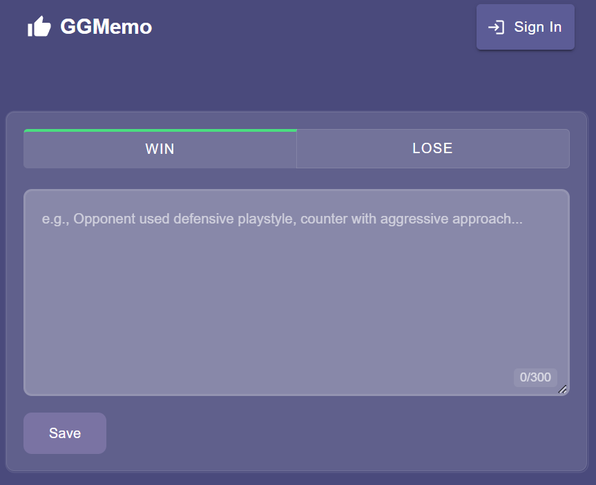
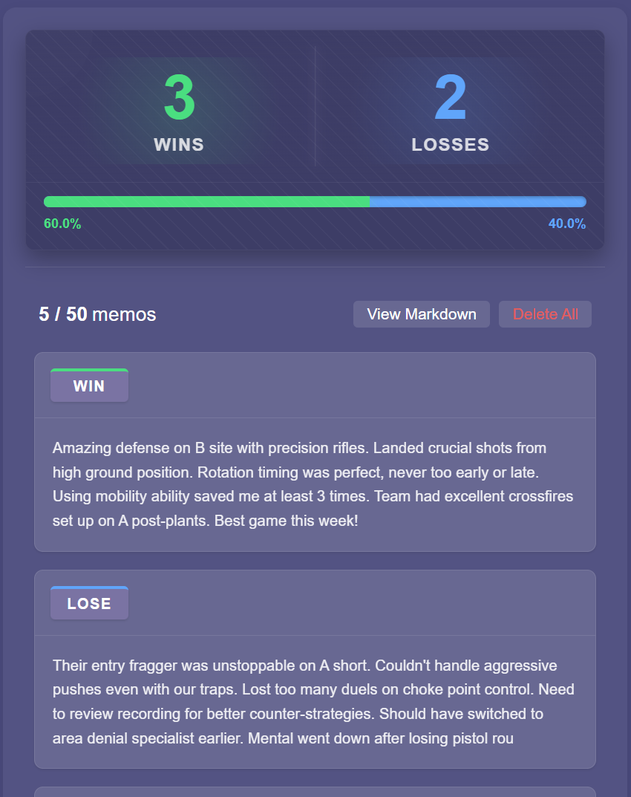

# GGMemo - Good Game Memo

<div align="center">
  
  <p><em>Take your gaming to the next level with strategic match notes</em></p>
  
  <a href="https://ggmemo.pokekoyomi.com" target="_blank">Try GGMemo Now</a>
</div>

## 📱 Overview

GGMemo ("Good Game Memo") is a powerful note-taking application designed specifically for gamers to track and analyze their match results. Whether you play casually or competitively, GGMemo helps you identify patterns and improve your gameplay through data-driven insights.

[Live Demo](https://ggmemo.pokekoyomi.com) | [Report Bug](https://github.com/hoshito/ggmemo/issues) | [Request Feature](https://github.com/hoshito/ggmemo/issues)

## 📸 Screenshots

<div align="center">
  
  <p><em>Quick memo creation</em></p>
  
  <p><em>Battle Stats and Memo List</em></p>
</div>

## ✨ Features

### Basic Mode (No Sign-in Required)
- Create quick memos with titles (up to 100 characters)
- Add, edit, and delete memos with ease
- View basic statistics about your games
- Store data securely in your browser
- Export your data in Markdown format

### Session Mode (With Google Sign-in)
- Create multiple battle sessions (up to 20) for different games or seasons
- Store more detailed memos per session (up to 50)
- Write comprehensive notes (up to 300 characters)
- Record win/loss results to track your success rate
- Add performance ratings to analyze your gameplay quality
- View detailed statistics and trends per session
- Sync your data seamlessly across all your devices
- Access your memos even when offline (as a PWA)

## 📲 How to Use

### Getting Started as a User

1. **Open GGMemo**: Visit [https://ggmemo.pokekoyomi.com](https://ggmemo.pokekoyomi.com)
2. **Basic Mode**: Start creating memos right away - no sign-in required!
3. **Session Mode**: Sign in with Google to unlock all features
4. **Install as PWA**: Add GGMemo to your home screen for offline access
   - On mobile: Tap "Add to Home Screen" in your browser menu
   - On desktop: Click the install icon in your browser's address bar

### Creating Your First Memo

1. Enter a game/match title
2. Select your result (Win/Lose)
3. Add any notes about the match
4. Click "Save" to store your memo
5. View your stats instantly!

## 🚀 Technologies

GGMemo is built with modern web technologies:

- **Frontend & Backend**: Next.js (App Router)
- **Language**: TypeScript
- **Authentication**: NextAuth, Firebase Authentication
- **Database**: Firebase Firestore
- **UI Framework**: Material UI
- **Testing**: Jest
- **Deployment**: Firebase App Hosting

## 🔧 For Developers

### Prerequisites

- Node.js 18.x or higher
- npm or yarn
- Firebase account (for full functionality)

### Installation

1. Clone the repository
   ```bash
   git clone https://github.com/hoshito/ggmemo.git
   cd ggmemo
   ```

2. Install dependencies
   ```bash
   npm install
   ```

3. Set up environment variables
   Create a `.env.local` file in the root directory with the following:
   ```
   # Google Analytics
   NEXT_PUBLIC_GA_MEASUREMENT_ID=your_ga_measurement_id

   # Next Auth
   NEXTAUTH_URL=http://localhost:3000
   NEXTAUTH_SECRET=your_nextauth_secret

   # Google OAuth
   GOOGLE_CLIENT_ID=your_google_client_id
   GOOGLE_CLIENT_SECRET=your_google_client_secret

   # Firebase Admin SDK
   FIREBASE_PROJECT_ID=your_firebase_project_id
   FIREBASE_CLIENT_EMAIL=your_firebase_client_email
   FIREBASE_PRIVATE_KEY=your_firebase_private_key

   # Firebase Client SDK
   NEXT_PUBLIC_FIREBASE_API_KEY=your_firebase_api_key
   NEXT_PUBLIC_FIREBASE_AUTH_DOMAIN=your_firebase_auth_domain
   NEXT_PUBLIC_FIREBASE_PROJECT_ID=your_firebase_project_id
   NEXT_PUBLIC_FIREBASE_STORAGE_BUCKET=your_firebase_storage_bucket
   NEXT_PUBLIC_FIREBASE_MESSAGING_SENDER_ID=your_firebase_messaging_sender_id
   NEXT_PUBLIC_FIREBASE_APP_ID=your_firebase_app_id
   ```

4. Run development server
   ```bash
   npm run dev
   ```
   Open [http://localhost:3000](http://localhost:3000) in your browser.

### Testing

Run the test suite with:

```bash
npm run test
```

For watching mode:

```bash
npm run test:watch
```

## 🔒 Privacy & Security

- User authentication handled securely via Firebase and NextAuth
- No sensitive game data shared with third parties
- Local storage option available for users who prefer not to sign in

## 📄 License

Distributed under the MIT License. See `LICENSE` for more information.

## 📬 Contact

- GitHub: [https://github.com/hoshito](https://github.com/hoshito)
- X(Twitter): [https://x.com/hoshitonton](https://x.com/hoshitonton)
- Project Link: [https://github.com/hoshito/ggmemo](https://github.com/hoshito/ggmemo)
- Website: [https://ggmemo.pokekoyomi.com](https://ggmemo.pokekoyomi.com)

---

<div align="center">
  <p>Made with ❤️ for gamers everywhere</p>
  <p>GG = Good Game</p>
</div>
